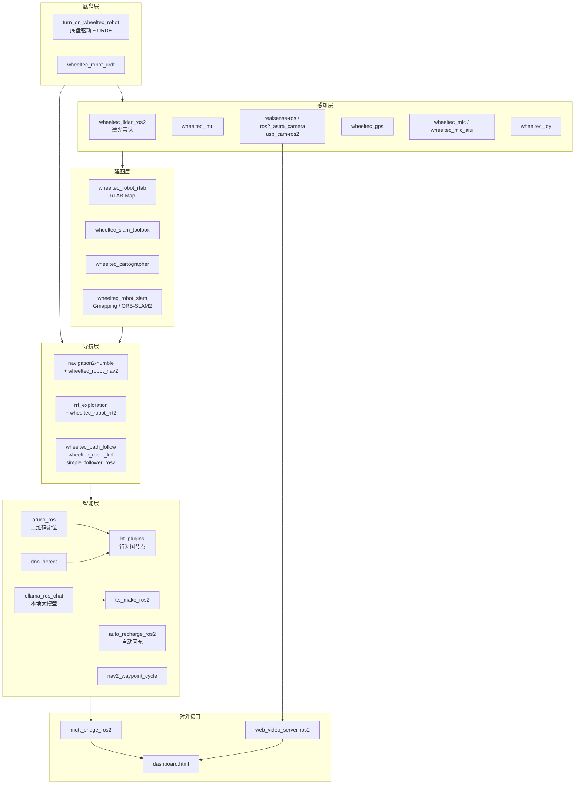

# 🤖 GKFD_car — 轮趣机器人 ROS2 Humble 综合开发平台

    [](https://github.com/DLDLDL13579/GKFD_car)

> **关于许可证**：本仓库根目录**没有 LICENSE 文件**，各包的授权状态以 `package.xml` 中的
> `<license>` 字段为准（部分为 `TODO: License declaration`，即尚未确定）。
> 仓库内还包含多个**上游第三方包**，其权利归各自原作者所有。详见文末 [归属与许可证](#-归属与许可证)。

---

**GKFD_car** 是一个基于 **ROS2 Humble** 的轮趣科技 (Wheeltec) 移动机器人全栈控制系统。项目将机器人底层驱动与上层智能算法深度融合，集成了从 **SLAM 建图**、**自主导航**、**RRT 自主探索**到**视觉伺服**、**行为树任务调度**、**大模型语音交互**的完整技术栈，覆盖了移动机器人开发的绝大多数核心场景。

> 工作路径: `~/wheeltec_ros2`  
> 目标硬件: 轮趣科技全系列底盘 + NVIDIA Jetson (Orin NX / Xavier NX / Nano) 或 x86 工控机

---

## 〇、当日订正（现行有效）（2026-09-20）

> 本节汇总 2026-09-18 ~ 2026-09-20 的**坐标系统一**工作，**现行有效**；正文对应位置已同步改写并标 `←订正2026-09-20`。历史记录一律保留。

**一句话结论**：主车导航主链路由 AMCL 回退为 **RTAB-Map**；主车与机械狗的二维栅格地图、三维点云地图、定位数据库**已统一到同一坐标系**，两车各自使用各自的点云与数据库，却输出同一坐标系下的位姿。

| # | 订正项 | 现行值 |
|---|---|---|
| 1 | 默认导航主线 | **RTAB-Map**（`largemodel_nav.launch.py`）；AMCL 降为可切换备用（`bash ~/start_nav.sh amcl`） |
| 2 | 语音链路起的栈 | `action_service.py:1046` = `largemodel_nav.launch.py`（`src` 与 `install` 两份同步） |
| 3 | 当前地图 `my_map.*` | **融合图** 1380×910 @0.05m，origin `[-12.812, -15.218]`，未知区 0% |
| 4 | 融合图来源 | 机械狗新图与主车 RTAB 建图配准融合：旋转 14.50°、平移 (0.00, -0.10)；车墙到狗墙中位距离 5.0 cm，容忍 20 cm 时重合 93.1% |
| 5 | `my_room.db` | 已做坐标系变换：170 个节点位姿左乘变换矩阵，静态验证 100% 落在融合图自由区 |
| 6 | AMCL 定位崩溃 | **已根治**（09-18）：根因是地图未知区占比过高致匹配场塌陷；修复后当日 11 次崩溃归零 |
| 7 | CPU 隔离 | 保持：`amcl` 绑核 4,5；`nav2_container` 绑核 0,1,2 |
| 8 | 旧发车点 | `(1.510, 4.350)` 与 `(0.763, -2.143)` **均已作废**（车不在图覆盖区内，需重测） |

**本轮备份**：`my_map.pgm/yaml.bak_carmap_20260918`、`my_map.pgm/yaml.bak_dogmap_20260918`、`my_room.db.bak_before_coordfix_20260918`、`action_service.py.bak_rtab_rollback_20260918`

---

## 📋 订正表

| 日期 | 订正范围 | 要点 |
|---|---|---|
| 2026-09-17 | 定位链路改造 | 引入 AMCL 主线：`start_nav.sh` 切换器、`largemodel_nav_amcl.launch.py` |
| **2026-09-20** | **坐标系统一** | **主链路由 AMCL 回退 RTAB；融合图启用为 `my_map.*`；`my_room.db` 坐标系变换；机械狗端 PCD 切换至新图** |

---

## 📋 目录

- [核心技术栈](#-核心技术栈)
- [硬件平台](#-硬件平台)
- [项目架构](#-项目架构)
- [包清单与功能索引](#-包清单与功能索引)
- [环境要求](#-环境要求)
- [快速开始](#-快速开始)
- [功能使用指南](#-功能使用指南)
- [开发者指南](#-开发者指南)
- [常见问题与排错](#-常见问题与排错)

---

## 🌟 核心技术栈

| 层级 | 技术 | 说明 |
|------|------|------|
| **建图** | RTAB-Map / Cartographer / SLAM Toolbox / Gmapping / ORB-SLAM2 | 2D 激光 + 3D RGB-D 混合 SLAM |
| **定位** | RTAB-Map 重定位（默认主线）+ AMCL（可切换备用） | RTAB-Map 视觉-激光重定位为默认主线；AMCL 粒子滤波 2D 定位完整保留、可一键切换 ←订正2026-09-20 |
| **导航** | Nav2 (Navigation2) | 全局/局部路径规划 + 动态避障 |
| **探索** | RRT (Rapidly-exploring Random Tree) | 前沿边界自主探索 + Mean Shift 聚类 |
| **任务编排** | Behavior Trees (行为树) | 视觉寻物 → 靠近 → 机械臂抓取完整闭环 |
| **视觉** | ArUco / KCF / DNN 检测 | 二维码定位、目标跟踪、深度学习检测 |
| **语音** | 麦克风阵列 + TTS | 语音识别、语音合成、声源定位 |
| **大模型** | Ollama + 本地 LLM | 本地大语言模型对话机器人 |
| **充电** | 自动回充 | 自主导航至充电桩并对接 |
| **多机** | 多机器人协同 | 多车编队控制与通信 |

---

## 🔧 硬件平台

### 支持底盘类型

| 类型 | 说明 |
|------|------|
| 两轮差速 | 标准差分驱动 |
| 四轮驱动 (4WD) | 四轮独立驱动 |
| **麦克纳姆轮** | 全向移动 (含 URDF 模型) |
| 全向轮 | 三/四轮全向 |
| 阿克曼转向 | 类似汽车转向 |
| 履带底盘 | 坦克式履带 |

### 传感器支持

| 传感器 | 驱动包 |
|--------|--------|
| 激光雷达 (Lidar) | `wheeltec_lidar_ros2` |
| 深度相机 (Astra) | `ros2_astra_camera` |
| 深度相机 (RealSense) | `realsense-ros` |
| USB 摄像头 | `usb_cam-ros2` |
| 麦克风阵列 | `wheeltec_mic`, `wheeltec_mic_aiui` |
| IMU | `wheeltec_imu` |
| GPS | `wheeltec_gps` |
| 摇杆 (Joystick) | `wheeltec_joy` |

### 机械臂支持

预置了多款与 MoveIt 兼容的四轴/六轴机械臂模型、URDF 描述文件，可与导航系统协同完成抓取任务。

---

## 🏗️ 项目架构

### 数据流与功能分层



### 源码目录树

```
wheeltec_ros2/
├── src/
│   ├── turn_on_wheeltec_robot/          # 🔌 机器人底层驱动
│   ├── wheeltec_robot_urdf/             # 🦾 URDF 机器人模型库
│   │
│   ├── wheeltec_robot_slam/             # 🗺️ Gmapping & ORB-SLAM2
│   ├── wheeltec_cartographer/           # 🗺️ Cartographer 配置
│   ├── wheeltec_slam_toolbox/           # 🗺️ SLAM Toolbox 配置
│   ├── wheeltec_robot_rtab/             # 🗺️ RTAB-Map 3D 建图 + Nav2
│   │
│   ├── navigation2-humble/              # 🧭 Nav2 导航栈 (完整源码)
│   ├── wheeltec_robot_nav2/             # 🧭 Nav2 导航配置
│   ├── rrt_exploration/                 # 🌲 RRT 自主探索算法
│   ├── wheeltec_robot_rrt2/             # 🌲 RRT2 探索启动配置
│   │
│   ├── bt_plugins/                      # 🧠 行为树自定义节点
│   ├── wheeltec_path_follow/            # ➡️ 路径跟踪
│   ├── simple_follower_ros2/            # 👤 人体跟随
│   ├── wheeltec_robot_kcf/              # 🎯 KCF 目标跟踪
│   │
│   ├── auto_recharge_ros2/              # 🔋 自动回充
│   ├── nav2_waypoint_cycle/             # 🔁 多目标点巡航
│   │
│   ├── aruco_ros-humble-devel/          # 📐 ArUco 二维码检测
│   ├── dnn_detect/                      # 🧠 DNN 深度学习检测
│   │
│   ├── ollama_ros_chat/                 # 💬 本地大模型对话
│   ├── tts_make_ros2/                   # 🔊 语音合成 TTS
│   ├── wheeltec_mic/                    # 🎤 麦克风驱动
│   ├── wheeltec_mic_aiui/               # 🗣️ AIUI 智能语音
│   │
│   ├── wheeltec_imu/                    # 📐 IMU 驱动
│   ├── wheeltec_lidar_ros2/             # 📡 激光雷达驱动
│   ├── wheeltec_gps/                    # 🛰️ GPS 驱动
│   ├── wheeltec_joy/                    # 🎮 遥控器驱动
│   ├── ros2_astra_camera/               # 📷 Astra 深度相机
│   ├── realsense-ros/                   # 📷 Intel RealSense
│   ├── usb_cam-ros2/                    # 📷 USB 摄像头
│   ├── web_video_server-ros2/           # 📺 Web 视频推流
│   │
│   ├── wheeltec_robot_msg/              # 📦 自定义消息
│   ├── wheeltec_rrt_msg/                # 📦 RRT 消息/服务/动作
│   ├── interfaces/                      # 📦 通用接口定义
│   │
│   ├── wheeltec_rviz2/                  # 🎛️ Rviz2 预置配置
│   ├── wheeltec_bodyreader/             # 🧍 人体姿态识别
│   ├── wheeltec_robot_keyboard/         # ⌨️ 键盘控制
│   ├── wheeltec_multi/                  # 👥 多机器人协同
│   ├── qt_ros_test/                     # 🖥️ Qt 测试界面
│   │
│   ├── depend/                          # 📚 第三方依赖
│   │   ├── ackermann_msgs-ros2/
│   │   ├── serial_ros2/
│   │   └── tf2_tools/
│   │
│   └── ...其他 ROS 官方包
│
├── mecanum_pro.urdf                     # 麦克纳姆轮 URDF 示例
├── install.sh                           # Ollama 安装脚本
├── collect_files.sh                     # 文件收集工具
├── ollama.service                       # Ollama systemd 服务
└── combined_files.txt                   # 关键配置文件汇总
```

---

## 📦 包清单与功能索引

### 🔌 底层驱动 (Bringup)

| 包名 | 语言 | 功能 |
|------|------|------|
| `turn_on_wheeltec_robot` | Python/Launch | **核心启动包** — 串口通信、摄像头(激光雷达)启动、EKF 融合、底盘驱动 |
| `wheeltec_robot_urdf` | URDF/Xacro | 全系底盘 + 机械臂 URDF 模型、STL 网格文件，支持 Rviz2 可视化 |

### 🗺️ SLAM 建图

| 包名 | 算法 | 传感器 | 特点 |
|------|------|--------|------|
| `wheeltec_robot_rtab` | RTAB-Map | RGB-D + LiDAR | **3D 点云 + 2D 栅格**混合建图，闭环检测强，带 Nav2 导航配置 |
| `wheeltec_cartographer` | Cartographer | 2D LiDAR | Google 开源方案，**低漂移、强闭环**，适合长廊等退化环境 |
| `wheeltec_slam_toolbox` | SLAM Toolbox | 2D LiDAR | ROS2 官方推荐，支持**建图/定位/地图序列化**生命周期管理 |
| `wheeltec_robot_slam` | Gmapping / ORB-SLAM2 | LiDAR / 单目-双目-RGBD | 经典 2D 建图 + 视觉 SLAM (Astra/Realsense) |

### 🧭 导航与探索

| 包名 | 功能 |
|------|------|
| `navigation2-humble` | Nav2 完整框架: 全局/局部规划 + 行为树导航；定位由 RTAB-Map 承担（默认主线），AMCL 可切换备用 ←订正2026-09-20 |
| `wheeltec_robot_nav2` | Nav2 参数配置与 launch 封装 |
| `rrt_exploration` | **RRT 前沿探索**核心算法: Global RRT + Local RRT + Mean Shift 聚类 |
| `wheeltec_robot_rrt2` | RRT 探索启动配置与 Nav2 集成 |
| `wheeltec_path_follow` | 路径跟踪控制器 |
| `simple_follower_ros2` | 人体跟随算法 |

### 🧠 智能任务

| 包名 | 功能 |
|------|------|
| `bt_plugins` | **行为树 C++ 插件**: `find_coloured_box`, `approach_coloured_box`, `pick_coloured_box` 等自定义节点 |
| `auto_recharge_ros2` | 自动充电: 保存充电桩位置 → 自主导航返回 → 红外/视觉对接 |
| `nav2_waypoint_cycle` | **多点巡航**: 设置多个航点并循环导航 |
| `wheeltec_robot_kcf` | KCF 目标跟踪 (视觉跟随) |
| `wheeltec_bodyreader` | 人体骨骼姿态识别与交互 |
| `dnn_detect` | 深度学习目标检测 (YOLO 等) |

### 📷 视觉传感

| 包名 | 功能 |
|------|------|
| `aruco_ros-humble-devel` | ArUco 二维码检测与定位 (ROS2 移植版)，含 4x4_1000, 582 等多系列词典 |
| `ros2_astra_camera` | Orbbec Astra / Astra Pro 深度相机驱动 |
| `realsense-ros` | Intel RealSense D400/T200 系列驱动 |
| `usb_cam-ros2` | 通用 USB 摄像头驱动 |
| `web_video_server-ros2` | HTTP Web 视频流推送 (浏览器实时查看画面) |

### 💬 语音与大模型

| 包名 | 功能 |
|------|------|
| `ollama_ros_chat` | Ollama 本地大语言模型 ROS 封装, 实现**语音 → LLM → 机器人动作**闭环 |
| `tts_make_ros2` | 文本转语音 TTS |
| `wheeltec_mic` | 麦克风阵列驱动 (声源定位 + 语音采集) |
| `wheeltec_mic_aiui` | 讯飞 AIUI 智能语音交互 |

### 📦 自定义接口

| 包名 | 内容 |
|------|------|
| `wheeltec_robot_msg` | 基础消息定义 |
| `wheeltec_rrt_msg` | **RRT 专用接口** — `PointArray.msg`, `ChangePosition.srv`, 动作接口等 |
| `interfaces` | 通用消息/服务/动作自定义 |

### 🎛️ 工具与可视化

| 包名 | 功能 |
|------|------|
| `wheeltec_rviz2` | 各功能模块的 Rviz2 预配置 (SLAM / Nav2 / RRT / RTAB / 模型) |
| `wheeltec_joy` | 遥控/摇杆控制支持 |
| `wheeltec_robot_keyboard` | 键盘远程控制 |
| `wheeltec_multi` | 多机器人通信与编队控制 |
| `qt_ros_test` | Qt 图形界面测试工具 |

---

## 💻 环境要求

### 系统

| 项目 | 要求 |
|------|------|
| 操作系统 | **Ubuntu 22.04** (推荐) 或兼容 Linux |
| ROS | **ROS2 Humble Hawksbill** (必须) |
| 架构 | `amd64` (x86) 或 `arm64` (Jetson Orin NX / Xavier NX / Nano) |
| Python | ≥ 3.10 |
| C++ 编译器 | GCC ≥ 11 (与 ROS2 Humble 一致) |

### 推荐硬件

- 轮趣科技 (Wheeltec) 底盘套装（含电机驱动板、STM32 底层控制器）
- NVIDIA Jetson Orin NX / Xavier NX（作为上位机）
- 激光雷达（思岚 / 万集 / 镭神等，已适配）
- 深度相机（Orbbec Astra 或 Intel RealSense D435 等）

### 核外依赖

| 依赖 | 用途 |
|------|------|
| `serial` (C++库) | 串口通信与底层驱动板交互 |
| `ackermann_msgs` | 阿克曼转向消息类型 |
| `nav2` (Navigation2) | 导航框架 |
| `BehaviorTree.CPP` | 行为树引擎 (v3.x) |
| `rtabmap_ros` | RTAB-Map SLAM |
| `cartographer_ros` | Cartographer SLAM |
| `slam_toolbox` | SLAM Toolbox |
| `orbslam2_ros` | ORB-SLAM2 视觉 SLAM |
| `moveit2` | 机械臂运动规划 |
| `ollama` | 本地大语言模型推理 |

---

## 🚀 快速开始

### 1️⃣ 创建工作空间 & 获取代码

```bash
mkdir -p ~/wheeltec_ros2/src
cd ~/wheeltec_ros2/src
git clone https://github.com/DLDLDL13579/GKFD_car.git .

# 或使用您自己的仓库地址
# git clone https://github.com/您的用户名/GKFD_car.git .
```

### 2️⃣ 安装系统依赖

```bash
cd ~/wheeltec_ros2

# 1) 更新 rosdep 并安装依赖
sudo rosdep init
rosdep update
rosdep install --from-paths src --ignore-src -r -y

# 2) 安装额外系统依赖
sudo apt update
sudo apt install -y \
    ros-humble-navigation2 \
    ros-humble-nav2-bringup \
    ros-humble-turtlebot3* \
    ros-humble-rtabmap-ros \
    ros-humble-slam-toolbox \
    ros-humble-behavior-tree \
    ros-humble-moveit2 \
    python3-serial \
    python3-yaml \
    python3-colcon-common-extensions
```

### 3️⃣ 安装 Ollama (大模型)

```bash
# 方式一: 使用项目提供的安装脚本
cd ~/wheeltec_ros2
chmod +x install.sh
./install.sh

# 方式二: 官方脚本
curl -fsSL https://ollama.com/install.sh | sh

# 拉取轻量模型
ollama pull qwen2.5:1.5b   # 适合边缘设备
# ollama pull llama3.2:1b   # 备用选择
```

### 4️⃣ 编译工作空间

```bash
cd ~/wheeltec_ros2

# 安装 colcon 编译工具 (如未安装)
sudo apt install python3-colcon-common-extensions

# 编译全部包 (--symlink-install 允许修改 Python 文件后免重新编译)
colcon build --symlink-install

# 如遇编译失败，可单独编译关键包排查
colcon build --packages-select wheeltec_rrt_msg
colcon build --packages-select turn_on_wheeltec_robot

# 刷新环境
source install/setup.bash
```

> 💡 建议将 source 命令加入 `~/.bashrc`:
> ```bash
> echo "source ~/wheeltec_ros2/install/setup.bash" >> ~/.bashrc
> source ~/.bashrc
> ```

### 5️⃣ 快速验证

```bash
# 查看所有可用 launch 文件
find src -name "*.launch.py" | head -20

# 启动 Rviz2 查看机器人模型
ros2 launch wheeltec_rviz2 wheeltec_rviz.launch.py
```

---

## 📖 功能使用指南

### 🗺️ SLAM 建图

#### 方案 A: Cartographer (2D 激光 — 推荐日常使用)

```bash
# 终端 1: 启动底盘与传感器
ros2 launch turn_on_wheeltec_robot turn_on_wheeltec_robot.launch.py

# 终端 2: 启动 Cartographer 建图
ros2 launch wheeltec_cartographer cartographer.launch.py

# 终端 3: 键盘控制移动建图
ros2 run wheeltec_robot_keyboard wheeltec_keyboard
```

- 一手遥控机器人走遍环境
- Cartographer 会自动闭环修正漂移
- 建图完成后保存地图:
```bash
ros2 run nav2_map_server map_saver_cli -f ~/maps/my_map
```

#### 方案 B: RTAB-Map (3D RGB-D + 激光 — 高精度)

```bash
ros2 launch wheeltec_robot_rtab rtabmap.launch.py
```

- 同时生成 2D 栅格地图 + 3D 点云
- 支持视觉词袋闭环检测
- 地图自动保存在 `~/.ros/rtabmap.db`

#### 方案 C: SLAM Toolbox (2D 激光 — 生命周期管理)

```bash
ros2 launch wheeltec_slam_toolbox slam_toolbox.launch.py
```

#### 方案 D: ORB-SLAM2 (仅视觉)

```bash
# 首次需解压词典文件
tar -xzf src/wheeltec_robot_slam/orb_slam_2_ros-ros2/orb_slam2/Vocabulary/ORBvoc.txt.tar.gz

ros2 launch wheeltec_robot_slam orb_slam2.launch.py
```

---

### 🧭 导航 (Nav2)

#### 使用已有地图导航

```bash
# 终端 1: 启动底盘
ros2 launch turn_on_wheeltec_robot turn_on_wheeltec_robot.launch.py

# 终端 2: 启动导航 —— 主车默认主线为 RTAB，用一键切换器（见下）
bash ~/start_nav.sh rtab          # ←订正2026-09-20（09-18 起由 AMCL 回退 RTAB）

# 终端 3: 在 Rviz2 中点击 "Nav2 Goal" 下发目标点
```

- 机器人在 Rviz2 中自动定位
- 支持动态避障、代价地图更新
- 可在导航过程中切换全局规划器

---

#### 🧭 主车导航链路：RTAB 主线 + AMCL 备用（←订正2026-09-20）

> **链路变更记录**：2026-09-17 曾以 AMCL 为主线；**2026-09-18 起回退为 RTAB 主线**（语音与前端链路随之走 RTAB），AMCL 完整保留、可一键切换。

主车提供**一键切换**（两套互斥 —— 都会发布 `map→odom`，切换会先清干净旧栈）：

```bash
bash ~/start_nav.sh rtab     # RTAB + my_room.db（主线；语音/前端控制链路走此栈）←订正2026-09-20
bash ~/start_nav.sh amcl     # AMCL + my_map.yaml（备用 / 可切回）
bash ~/start_nav.sh status   # 查看当前跑哪套
```

`rtab` 分支起 `largemodel_nav.launch.py`（rtabmap 重定位 + `my_room.db`）。

`amcl` 分支自动完成：**清旧栈**（组件进程 + launch 残留都要清；只 kill launch 会留下容器子进程，导致新栈报 `Failed to change state for node: controller_server`）→ 起 `largemodel_nav_amcl.launch.py` → 校验 `lifecycle active` / AMCL 收到激光 / 打印**实际加载的地图** → 全局定位给出初始位姿。

**语音链路起的栈**（`action_service.py:1046`）已于 2026-09-18 由 `largemodel_nav_amcl.launch.py` 改回 **`largemodel_nav.launch.py`**；建图与保存链路本就为 RTAB（`largemodel_slam.launch.py`，默认 `Localization=false` 带 `-d` 删库重建）。←订正2026-09-20

**地图闭环**（语音建图结束后，RTAB / AMCL 均无需配置改动即可使用）：

```
语音"结束建图" → map_saver_cli -f .../wheeltec_robot_rtab/my_map → my_map.pgm + my_map.yaml（+ my_room.db）
RTAB / AMCL 导航 → 加载同一份 my_map.yaml
```

**当前地图（←订正2026-09-20）**：`my_map.*` = **融合图**，1380×910 @0.05m，origin `[-12.812, -15.218]`，未知区 0%。它由「机械狗新建图」与「主车 RTAB 建图」配准融合而成：旋转 14.50°、平移 (0.00, -0.10)，配准后车墙到狗墙中位距离 5.0 cm、容忍 20 cm 时重合 93.1%。**主车与机械狗现已处于同一坐标系**，两车各自使用各自的点云与定位数据库。`my_room.db` 已做坐标系变换（170 个节点位姿左乘变换矩阵）以对齐该图。

**常用操作**：

```bash
export RMW_FASTRTPS_USE_SHM=false    # ⚠️ 所有 CLI / 脚本都要带（与 launch 一致），否则可能卡住
python3 ~/lgm.py                     # 全局定位：自动从 my_map.yaml 读地图参数，输出初始位姿
python3 ~/sip_arg.py <x> <y> <yaw>   # 设初始位姿（或 RViz 点 2D Pose Estimate）
python3 ~/check_scan.py              # 双 QoS 激光探针
```

⚠️ **改 launch 必须 `src` 与 `install` 两份同步**（`install/` 是实体文件不是软链，否则 `ros2 launch` 仍跑旧版）。

---

### 🌲 RRT 自主探索

无需人工干预，机器人自动对未知区域进行边界探索:

```bash
# 终端 1: 启动底盘 + 激光雷达
ros2 launch turn_on_wheeltec_robot turn_on_wheeltec_robot.launch.py

# 终端 2: 启动 RRT 探索 (含 Nav2)
ros2 launch wheeltec_robot_nav2 rrt_exploration.launch.py
```

**工作流程**:

1. **Global RRT** 在地图空闲区域生长随机树
2. **Frontier Detection** 检测前沿边界点
3. **Mean Shift 聚类** 将前沿点聚簇
4. **Nav2 导航** 自动下发最优目标点
5. 重复直至全空间覆盖

---

### 🔁 多点巡航

```bash
# 启动导航
ros2 launch wheeltec_robot_rtab wheeltec_nav2_rtab.launch.py

# 运行巡航节点
ros2 run nav2_waypoint_cycle waypoint_cycle
```

通过 Rviz2 的 "Publish Point" 工具依次点击目标点，机器人会按顺序循环导航。

---

### 🔋 自动回充

```bash
# 保存充电桩位置 (将机器人开到充电桩旁)
ros2 run auto_recharge_ros2 auto_recharger

# 脚本交互:
# - 按 's' 保存当前位置为充电桩坐标
# - 按 'g' 出发前往充电桩
# - 靠近后自动红外对接充电
```

充电桩位置保存在 `auto_recharge_ros2/Charger_Position.json`。

---

### 👤 人体跟随

```bash
ros2 launch simple_follower_ros2 simple_follower.launch.py
```

使用激光雷达或深度相机，机器人自动跟踪前方行人。

---

### 📐 ArUco 二维码检测

```bash
ros2 launch aruco_ros aruco_recognize.launch.py
```

支持多种二维码字典: `4x4_1000`, `582` 等，可用于:
- 导航目标点标记
- 机械臂抓取定位
- 移动机器人视觉着陆

---

### 💬 大模型对话 (Ollama)

```bash
# 确保 Ollama 服务运行中
ollama serve

# 启动 ROS 对话节点
ros2 run ollama_ros_chat ollama_chat_node
```

**集成链路**:

```
用户语音 → 麦克风 → ROS → Ollama LLM → ROS → 导航/机械臂/语音回复
```

支持离线运行，无网络依赖，适合工业 / 室内场景。

---

### 📺 Web 视频监控

```bash
ros2 launch web_video_server-ros2 web_video_server.launch.py
```

浏览器访问 `http://<机器人IP>:8080` 实时查看摄像头画面。

---

### 🔊 TTS 语音合成

```bash
ros2 run tts_make_ros2 tts_node
```

机器人语音播报导航状态、检测结果等。

---

## 🛠️ 开发者指南

### 添加新包

```bash
cd ~/wheeltec_ros2/src

# Python 包
ros2 pkg create my_package --build-type ament_python --dependencies rclpy

# C++ 包
ros2 pkg create my_package --build-type ament_cmake --dependencies rclcpp
```

### 添加自定义接口

```bash
cd ~/wheeltec_ros2/src

# 消息包标准结构
ros2 pkg create my_interfaces --build-type ament_cmake
```

创建后在 `my_interfaces/msg/` 下添加 `.msg` 文件，并在 `CMakeLists.txt` 中注册:
```cmake
rosidl_generate_interfaces(${PROJECT_NAME}
  "msg/MyMessage.msg"
  "srv/MyService.srv"
)
```

> ⚠️ 修改接口后必须完全重新编译该包:
> ```bash
> colcon build --packages-select my_interfaces --cmake-clean-cache
> ```

### 行为树开发

`bt_plugins` 包提供自定义 BT 节点模板:

```cpp
// 示例: 自定义动作节点
class FindColouredBox : public BT::StatefulActionNode {
public:
  FindColouredBox(const std::string& name, const BT::NodeConfig& config)
    : BT::StatefulActionNode(name, config) {}

  BT::NodeStatus onStart() override {
    // 发起视觉检测请求
    return BT::NodeStatus::RUNNING;
  }

  BT::NodeStatus onRunning() override {
    // 轮询检测结果
    if (found) return BT::NodeStatus::SUCCESS;
    return BT::NodeStatus::RUNNING;
  }

  void onHalted() override {
    // 取消任务
  }
};
```

### 文件与数据管理

- **地图数据库**: `*.db` (RTAB-Map) 体积较大, 已在 `.gitignore` 中排除
- **数据包**: `*.bag` 已排除, 切勿推送到 GitHub
- **编译产物**: `build/`, `install/`, `log/` 已排除
- **IDE 配置**: `.vscode/`, `.idea/` 已排除

### 开发辅助脚本

```bash
# 收集关键配置文件到 combined_files.txt (方便审查)
./collect_files.sh
```

---

## ❓ 常见问题与排错

### Q1: 编译失败 — `wheeltec_rrt_msg` 找不到

```
解决方法:
colcon build --packages-select wheeltec_rrt_msg --cmake-clean-cache
source install/setup.bash
colcon build --symlink-install
```

### Q2: 串口无法打开 — `/dev/ttyUSB0` 权限不足

```bash
# 将当前用户加入 dialout 组
sudo usermod -a -G dialout $USER
# 重新登录或重启后生效

# 临时提权
sudo chmod 666 /dev/ttyUSB0
```

### Q3: Ollama 下载模型太慢

```bash
# 使用国内镜像 (环境变量)
export OLLAMA_HOST=0.0.0.0

# 手动从 ModelScope 下载:
# https://modelscope.cn/models/qwen/Qwen2.5-1.5B-Instruct-GGUF
```

### Q4: RTAB-Map 建图卡顿

- 降低地图分辨率: 在 `rtabmap_nav_params.yaml` 中调整 `map_occupancy_resolution: 0.05`
- 关闭可视化: 在 launch 文件中设置 `visualization:=false`
- Jetson 设备考虑开启 `NVMM` 硬件编码

### Q5: Nav2 导航无法规划路径

- 确认 `map` 话题有正确发布
- 检查 `transform` 树: `ros2 run tf2_tools view_frames.py`
- 确保里程计话题 `odom` 数据正常
- 查看代价地图: Rviz2 中添加 `/global_costmap` 和 `/local_costmap` 显示

### Q6: 行为树节点不执行

```bash
# 检查自定义 BT 节点是否被插件系统加载
ros2 run bt_plugins list_nodes  # (如可用)

# 确认 XML 文件中的节点名称与 C++ 注册名称一致
# 检查 wheeltec_rrt_msg 是否已编译
```

### Q7: Nav2 报 `Extrapolation Error`，且 `Requested time` 一直不变（←新增2026-09-17）

**真因是上游定位节点已死**（AMCL 崩溃），**不是 TF 配置问题**。TF 缓存是滚动窗口，节点死后旧时间戳被挤出窗口，于是持续报错。

```bash
grep -a "process has died" ~/nav_amcl*.log    # 应能看到 exit code -11
bash ~/start_nav.sh amcl                       # 重起 AMCL 栈
```

**←订正2026-09-20：该崩溃已根治，根因不是参数也不是 CPU。** 真因是**地图未知区占比过高**（实测 87.4%）——`map_server` 把 PGM 的 205 判为 `OccupancyGrid` 的 -1，而 AMCL 只把 `data==100` 当障碍，于是未知区等于「此处没有墙」，似然场塌陷、粒子权重归零后 SIGSEGV。修复要领：**地图未知区必须为 0%**（区域外要么用真实墙体、要么标为占用）。修图 + CPU 隔离（`amcl` 绑核 4,5、`nav2_container` 绑核 0,1,2）后，当日 11 次崩溃归零，五个标记点全部跑通。

### Q8: `/scan` 有 publisher 但收不到数据（←新增2026-09-17）

两种可能，用**双 QoS 探针**区分：

```bash
python3 ~/check_scan.py     # reliable / best_effort 都收不到 ⇒ 发布端真没数据
```

- **真没数据**：雷达串口失效（USB 重新枚举后驱动仍捏着失效的 fd）→ `systemctl --user restart largemodel-control`
- **只有一种 QoS 收到**：QoS 不匹配，检查订阅端配置

另：控制栈启动后若雷达/底盘节点缺失、`action_service` 刷"传感器数据异常: 相机, 雷达, 里程计"，也是同一类问题（串口枚举比服务启动晚，服务 `ExecStartPre` 只等麦克风不等串口）→ 同样重启 control 服务。

### Q9: 所有导航目标都被 REJECTED（←新增2026-09-17）

大概率**误删过 `/dev/shm/fastrtps_*`**，破坏了 FastDDS 共享内存状态。**症状特征**：外部进程之间通信正常（`topic echo /scan` 有数据），但"外部 ↔ 容器内节点"不通（`topic echo /amcl_pose` 为空、CLI `action send_goal` 卡住）—— 而 AMCL 恰在容器里。

```bash
systemctl --user restart largemodel-control    # 1) 重启 control 栈
bash ~/start_nav.sh amcl                       # 2) 再重起 nav2 栈（不必重启整机）
# 判据：AMCL 日志重新出现 createLaserObject
```

**←订正2026-09-20**：此处原记作「绝对不要删」，说法过于绝对。恰当规则是 **只在所有 ROS 进程停止时清理** —— 先停 control 栈与 nav2 栈 → 再删 → 再依次起 control、nav2；运行中直接删会破坏 FastDDS 共享内存状态，症状见本节上文。

### Q10: 导航目标无法完成（原地不动 / 反复原地转向）（←新增2026-09-17）

查 `~/nav_amcl*.log`：

- `Failed to make progress` ⇒ 车在终点附近**原地对姿**、位移不足，被 `progress_checker` 判为卡死（当前 `required_movement_radius: 0.25` / `movement_time_allowance: 20.0`）
- **麦轮底盘务必用 `robot_model_type: nav2_amcl::OmniMotionModel`** —— 用差速模型会导致末端对姿反复失败（实测同一点位从"超时 150 s"变为"26.6 s 到达"）
- `xy_goal_tolerance` 不要小于车的实际控制精度（实测 2.4~5.9 cm，当前设 **0.10** 留余量；曾收到 0.05 导致永远判不了到达）
- **`use_respawn` 对容器内组件无效** —— AMCL 崩了不会被自动拉起，需要独立看门狗

**←订正2026-09-20：该问题已解决，不再是「已知未解」**。2026-09-17 记录的「CPU 过载」线索只是伴随现象；真正根因是**地图未知区占比过高致匹配场塌陷**（详见 Q7 订正段）。已于 09-18 修复：地图未知区归零 + CPU 隔离 + 粒子数降至 2000/500 + 放宽定位更新阈值，当日 11 次崩溃归零。AMCL 现保留为可切换备用链路，主线为 RTAB-Map。

---

## 📄 归属与许可证

### 现状说明

⚠️ **本仓库根目录没有 `LICENSE` 文件**，因此**不声明统一的项目许可证**。
各包的授权状态以各自 `package.xml` 中的 `<license>` 字段为准：

| 包 | `package.xml` 中的声明 |
|---|---|
| `mqtt_bridge_ros2` | `MIT` |
| `tts_make_ros2` | `Apache-2.0` |
| `largemodel` | `TODO: License declaration`（**尚未确定**） |
| `auto_recharge_ros2` | `TODO: License declaration`（**尚未确定**） |
| `nav2_waypoint_cycle` | `TODO: License declaration`（**尚未确定**） |
| `simple_follower_ros2` | `TODO: License declaration`（**尚未确定**） |
| `wheeltec_robot_rtab` | `TODO: License declaration`（**尚未确定**） |
| `usb_cam-ros2` | `BSD` |

> 建议：若要对外声明 MIT，请补充根目录 `LICENSE` 文件，并把各包 `package.xml`
> 中的 `TODO: License declaration` 补全，避免分发时产生授权歧义。

### 上游第三方包（权利归原作者）

本工作区包含多个**直接引入的上游开源包与厂商 SDK**，这些内容**不是本项目原创**：

| 包 / 目录 | 来源与归属 |
|---|---|
| `navigation2-humble/` | [ROS 2 Navigation2](https://github.com/ros-planning/navigation2)（Apache-2.0） |
| `realsense-ros/` | [IntelRealSense/realsense-ros](https://github.com/IntelRealSense/realsense-ros)（Apache-2.0） |
| `aruco_ros-humble-devel/` | [Aruco ROS](https://github.com/pal-robotics/aruco_ros)（BSD，仓库内附独立 LICENSE） |
| `usb_cam-ros2/` | [ros-drivers/usb_cam](https://github.com/ros-drivers/usb_cam)（BSD） |
| `web_video_server-ros2/` | [RobotWebTools/web_video_server](https://github.com/RobotWebTools/web_video_server)（BSD） |
| `wheeltec_*`（底盘、雷达、IMU、麦克风、GPS、KCF、URDF、导航配置等） | **轮趣科技（Wheeltec）** 厂商 SDK，版权归原厂商所有 |
| `ros2_astra_camera/` | Orbbec Astra 相机 ROS2 驱动 |
| `auto_recharge_ros2`、`rrt_exploration` 等 | 参考社区开源实现 |

### 致谢

- [轮趣科技 (Wheeltec)](https://www.wheeltec.net/) — 底盘硬件与底层 SDK
- [ROS2 Navigation2](https://github.com/ros-planning/navigation2) — 导航框架
- [RTAB-Map](https://github.com/introlab/rtabmap) — 3D SLAM
- [Cartographer](https://github.com/ros2/cartographer) — 2D SLAM
- [Ollama](https://ollama.com) — 本地大模型推理
- [ORB-SLAM2](https://github.com/raulmur/ORB_SLAM2) — 视觉 SLAM

---

<p align="center">
  <sub>Powered by ROS2 Humble · Maintained by <a href="https://github.com/DLDLDL13579">@DLDLDL13579</a></sub><br>
  <sub>项目地址: <a href="https://github.com/DLDLDL13579/GKFD_car">github.com/DLDLDL13579/GKFD_car</a></sub>
</p>
